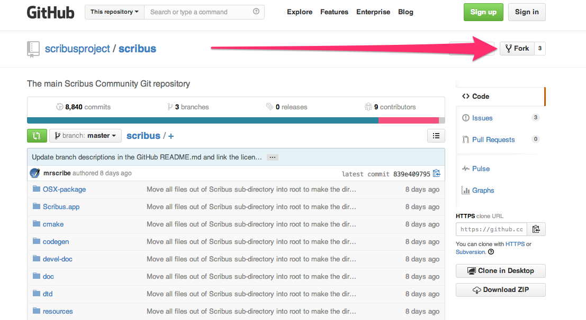

# Contributing to Scribus

## Contributing code

## Improving the user interface

## Testing and writing bug reports

## Writing manuals, articles, documentation

# Installing the development version of Scribus

The current development version of Scribus is 1.5svn.

If you want to play with it and, eventually, submit propositions for improvements or bug reports you can get a pre-compiled package, if one is available for your platform.

## Installing the program

### Ubuntu

- getting the PPA from <https://launchpad.net/~scribus/+archive/ubuntu/ppa>

TODO: shortly explain how to use the PPA and reference Ubuntu resources for more information.

### OpenSuse

### Other Linux

### OS X

TODO: explain how to get from homebrew

- `homebrew`

### Windows

TODO: explain how to get a Virtualbox to work

## Getting the sources and compiling them

### Linux

### OS X

TODO: reference on working with Qt Creator

### Windows

TODO: reference to working with Virtualbox in the binaires part

TODO: reference on working with Qt Creator

# Github: forking, branching and the pull request

- If you don't have an account on Github, create one
- Fork the Scribus repository:
    - Go to https://github.com/scribusproject/scribus
    - Click on the button in the top right corner that says "Fork"  
        
      
    - You now have your own repository called Scribus (https://github.com/yourname/scribus, where yourname is the name you have chosen for Github)
- Each time you want to do a patch, create a new branch of your repository, with a name that matches your change.
- In Scribus find a string that refers to what you want to change and that is somehow not too common.
- On Github, search for that string in the repository by using the "Search" field in the top part of the page.
- Click on the file that matches your result (you might have to click on a few files before finding the right one; if you get too many results, try to use another search criterium and put quotes around sentences)
- Click on the edit icon make the change and commit it.
- If you want to test the change, clone the repository on your computer (or pull the new version if you already have it locally), switch to the new branch and compile as usual.
- If you're happy with your change, make a pull request by going to the main page of your repository and clicking on the green button left of the branch name, in the header of the page.
- Don't use the same branch for other changes, since those will be added to the pull request you already sent.
Once you're comfortable with this way of doing, you should try to do patches on the source code that you have pulled on your computer.

# Using Qt Creator
...

# Working with SVN

The official Scribus repository is provided through SVN at <svn://scribus.net/Scribus>

# Proposing a patch

If you want to directly propose a patch to the Scribus, you cannot yet use the process described in the Github specific section.

## Creating a patch file

- when doing the diff, you have to be in the main scribus directory (the one below the "scribus/" directory that contains the whole code).
- use the version system to create the patch:
  - `svn diff scribus/the_file_you_have_modified > name_of_my_patch.diff`
  - `git diff scribus/the_file_you_have_modified > name_of_my_patch.diff`
  that way you don't have to keep a copy of the original file, but can "automatically" compare the file you modified with the version you got when you last updated the repository.

Of course, you don't have to use the command line tool, but you can use your svn or git client to create the patch.

## Uploading a patch to the bug tracker

Once you have crated an account for the bug tracker you can attach your patch to an existing ticket (or create first a new ticket for it, if none matching exists).

- upload each diff file individually: that way they can be viewed in mantis itself

# Working with Qt Creator

## Creating a patch

While the file is opened, go to `Tools > Subversion > Diff "filename.cpp"`

There is also an option to make a diff of the whole source

# Working with Qt5

- [A Book about Qt5](http://qmlbook.org/): approaching Qt from the QML side

# Learning QML and Qt Quick

- The QML reference and tutorials built in Qt creator.
- [Qt/Qt Quick Overview](http://en.wikibooks.org/wiki/Qt/Qt_Quick_Overview)
- [QMLBlog](http://qmlbook.org/blog/index.html)
- [The Whole Shebang - Running QML Files Directly](http://www.ics.com/blog/whole-shebang-running-qml-files-directly?utm_medium=social+media&utm_source=social+media&utm_content=whole-shebang-running-qml-files-directly&utm_campaign=June+2014+Social+Media#.U-KhAHUci03)

## C++ and Qt Quick

## Python, PyQt and Qt Quick
